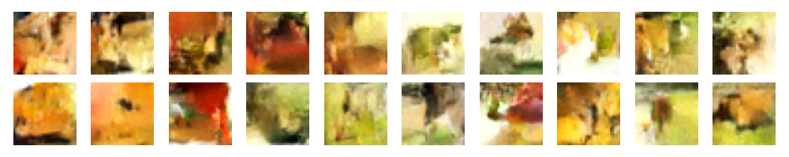

# DDPM(Denoising Diffusion Probabilistic Models) 구현
해당 저장소에서는 DDPM에 대해 설명하고 구현한다.

## 1. DDPM 설명
DDPM에 대한 개념과 수식설명은 다음 블로그에서 확인하실 수 있습니다.
[DDPM(Denoising Diffusion Probabilistic Models) 논문 리뷰](https://velog.io/@jjadestarr/DDPMDenoising-Diffusion-Probabilistic-Models-%EB%85%BC%EB%AC%B8-%EB%A6%AC%EB%B7%B0)

## 2. Model Architecture

### Loss Function
논문에서 정의된 Simplified Loss Function을 사용합니다.
$$
\begin{aligned}
&x_0 \sim q(x_0) \\
&t \sim Uniform{1, T} \\
&\epsilon \sim \mathcal{N}(0,I) \\
&Loss = \left\|\epsilon - \epsilon_\theta(\sqrt{\bar{\alpha}_t}x_0 + \sqrt{1 - \bar{\alpha}_t}\epsilon, t) \right\|^2
\end{aligned}
$$

### Config
* **Dataset:** CIFAR-10 (32x32x3)
* **Epochs:** 800 Epochs
* **Diffusion Steps (T):** 1000 steps
* **Batch Size**: 64

## 3. 실행 방법

#### 1 ) 모델 학습
```bash
python ddpm_train.py
```

#### 2 ) 이미지 생성
```bash
python ddpm_generate.py
```

## 4. 학습 및 이미지 생성 결과
##### 1 ) 50epochs 에서의 샘플링 결과


##### 2 ) 800epochs 에서의 샘플링 결과


