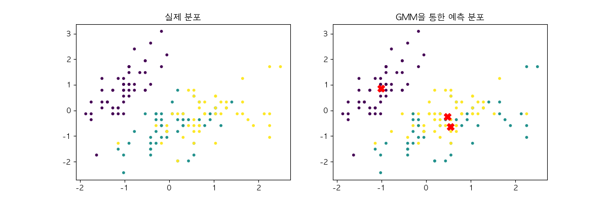
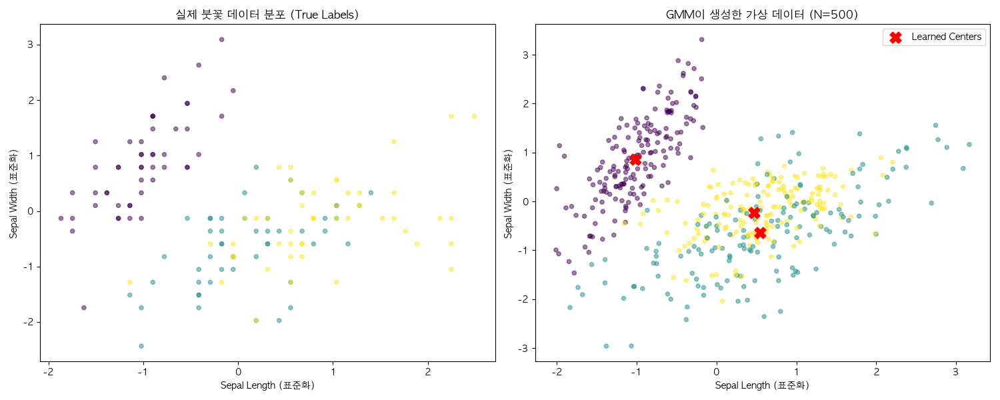

# EM(Expectation Maximization) Algorithm 구현
여기선 GMM에서의 EM알고리즘 주요 수식, 구현과정, 구현결과를 설명한다.

## 1. 가우시안 혼합 모델(GMM, Gaussian Mixture model)
가우시안 혼합 모델이란 정규 분포 여러 개를 혼합한 모델이다.  
이는 복잡하게 분포된 데이터라 할지라도 여러 개의 가우시안 종 모양(Bell Curve)을 겹쳐서 표현하면 그 분포를 정확하게 근사할 수 있다.  
K개의 정규분포가 있다고 할 때, k번째 정규분포에서 출현할 확률을 구해야한다.
이는 범주형 분포로 표현할 수 있으며 이산 확률 변수인 잠재변수 z와 범주형 분포의 매개변수 $\phi$를 사용한다.  

$$
\begin{aligned}
&\phi = \lbrace \phi_1, \phi_2, \dots, \phi_K \rbrace \\
&p(z=k ; \phi) = \phi_k
\end{aligned}
$$

이때 정의되는 정규분포는 x가 벡터인 다변량 정규분포로 정의된다.

$$p(x|z=k; \mu, \Sigma) = \mathcal{N}(x; \mu_k, \Sigma_k)$$

식을 정리하여 우리의 목표값인 $p(x)$를 구하면 다음과 같다.

$$p(x) = \sum_{k=1}^{K}\phi_k\cdot \mathcal{N}(x; \mu_k, \Sigma_k)$$

## 2. ELBO(Evidence Lower BOund)도출
관찰가능한 확률 변수 x, 잠재변수 z, 매개변수가 $\theta = \lbrace \phi, \mu, \Sigma \rbrace$일 때, 로그가능도는 다음과 같이 표현할 수 있다.  
이때 $q(z)$는 로그가능도를 해석적으로 풀었을 때 발생하는 log-sum 문제를 해결하기 위해 사용한 확률분포이다.

$$ logp_\theta(x) = \sum_{z}q(z)log\frac{p_\theta(x,z)}{q(z)} + D_{KL}(q(z) || p_\theta(z|x)) $$

KL발산항은 항상 0이상이므로 다음과 같이 정의할 수 있다.

$$log p_\theta(x) \geq  \sum_{z}q(z)log\frac{p_\theta(x,z)}{q(z)}$$

이때 $\sum_{z}q(z)log\frac{p_\theta(x,z)}{q(z)}$ 항을 ELBO라고 정의하며 정리하여 다음과 같이 표기할 수 있다.

$$ ELBO(x;q,\theta) = \sum_{z}q(z)log\frac{p_\theta(x,z)}{q(z)} $$

이제 해석적으로 구할 수 없었던 로그가능도를 ELBO를 통해 간접적으로 최대화시킨다.
즉 ELBO가 로그가능도에 최대한 가까워지도록 ELBO를 최대화시키는 것이 EM 알고리즘의 궁극적인 목표이다.  

추가적으로 데이터 x가 하나가 아닌 N개이고 각 데이터에 따른 임의의 확률분포 q(z)또한 N개일 때 다음과 같이 정의할 수 있다.
이때 전체 데이터 $X$에 대응하는 잠재 변수 집합 $Z = \lbrace z^1, z^2, \dots, z^N \rbrace$이 존재하고 $z$하나에 군집 K개를 가지고 있으므로 다음과 같이 표현할 수 있다.  

$$
\begin{aligned}
\sum_{n=1}^{N} \log \sum_{z^n} p_\theta(x^n, z^n) 
&\geq \sum_{n=1}^{N} \text{ELBO}(x^n; q^n, \theta) \\
&= \sum_{n=1}^{N} \sum_{z^n} q^n(z^n) \log \frac{p_\theta(x^n,z^n)}{q^n(z^n)}
\end{aligned}
$$

## 3. EM 알고리즘
EM 알고리즘이란 기댓값을 최대화하는 알고리즘이다.  
EM 알고리즘을 사용하면 GMM(Gaussian Mixture Model)의 매개변수를 효율적으로 추정할 수 있다.
EM 알고리즘은 두 스텝으로 이루어져 있다.  

### 3.1 E-스텝
E-스텝에서는 KL발산 항을 0으로 만들어 고정된 $\theta = \lbrace \phi, \mu, \Sigma \rbrace$ 위치에서 로그가능도와  ELBO가 같아지도록 만든다.  
이때 $D_{KL}(q^n(z) || p_\theta(z|x^n)) = 0$이 되기 위해서는 $q^n(z) = p_\theta(z|x^n)$ 이어야 한다.

$$
\begin{aligned}
q^n(z=k) &= p_\theta(z=k|x^n) \\
&= \frac{p_\theta(x^n, z=k)}{p_\theta(x^n)} \\
&= \frac{\phi_k \mathcal{N}(x^n; \mu_k, \Sigma_k)}{\sum_{j=1}^{K}\phi_j \mathcal{N}(x^n; \mu_j, \Sigma_j)}
\end{aligned}
$$

### 3.2 M-스텝
M-스텝에서는 ELBO가 최대화되는 때의 $\theta$를 찾는다.  
E-스텝에서 구한 $q^n$을 고정하고 $\theta = \lbrace \phi, \mu, \Sigma \rbrace$를 갱신한다.  
그러기 위해서는 ELBO값을 미분하여 값이 최대화 되는 $\theta$를 구하면 된다.  
ELBO식으로 부터 매개변수 $\theta$와 관련있는 항을 목적함수로 정의하고 그때 정의한 목적함수는 다음과 같다.  

$$
\begin{aligned}
J(\phi, \mu, \Sigma)&=\sum_{n=1}^{N} \sum_{j=1}^{K} q^n(j)log\phi_j\mathcal{N}(x^n; \mu_j, \Sigma_j) \\
&= \sum_{n=1}^{N} \sum_{j=1}^{K} q^n(j)\left (log\phi_j + log\mathcal{N}(x^n; \mu_j, \Sigma_j)  \right )
\end{aligned} 
$$

목적함수를 $\phi, \mu, \Sigma$에 대해 각각 미분하면 다음과 같은 값들을 얻을 수 있다.

$$
\begin{aligned}
&\phi_k = \frac{1}{N}\sum_{n=1}^{N}q^n(k) \\
&\mu_k = \frac{\sum_{n=1}^{N}q^n(k)x^n}{\sum_{n=1}^{N}q^n(k)} \\
&\Sigma_k = \frac{\sum_{n=1}^{N}q^n(k)(x^n-\mu_k)(x^n-\mu_k)^T}{\sum_{n=1}^{N}q^n(k)}
\end{aligned} 
$$

### 3.3 종료조건
데이터가 N개일 때 로그가능도의 평균을 계산하여 이전 로그가능도의 평균과 비교하며 이때 변화량이 임곗값 이하면 학습을 종료한다.  
EM알고리즘은 매 반복마다 로그가능도가 항상 단조증가하기 때문이다.  

$$
logp(x; \theta_{new}) \geq logp(x;\theta_{old})
$$

로그가능도의 평균은 다음과 같이 계산할 수 있다.

$$
\frac{1}{N}\sum_{n=1}^{N}logp(x^n; \theta) = \frac{1}{N}\sum_{n=1}^{N}log\sum_{j=1}^{K}\phi_j\mathcal{N}(x^n; \mu_j, \Sigma_j)
$$

## 4. Model Architecture
### 4.1 Dataset & Preprocessing
* **Dataset**: Iris Dataset ($N=150$, $D=4$)
* **Preprocessing**: 특성(Feature) 간의 스케일 차이로 인해 공분산 행렬 계산이 불안정해지는 것을 방지하기 위해, 모든 데이터를 평균이 0이고 표준편차가 1인 표준 정규분포로 정규화(Z-score Normalization)하여 사용하였다.

### 4.2 Initialization (초기화)
Iris 데이터셋의 실제 클래스 개수에 맞춰 군집 수 $K=3$으로 설정했으며, 매개변수 $\theta = \lbrace \phi, \mu, \Sigma \rbrace$는 다음과 같이 초기화하였다.
* **$\phi$ (혼합 계수)**: 모든 군집이 동일한 확률을 갖도록 균등 분포(`1/K`)로 초기화.
* **$\mu$ (평균)**: 표준 정규분포(`np.random.randn`)에서 무작위 추출.
* **$\Sigma$ (공분산 행렬)**: $D \times D$ 크기의 단위 행렬(Identity Matrix, `np.eye(D)`)로 안정성을 확보하여 초기화.

### 4.3 EM Pipeline
* **E-Step**: 다변량 정규분포 함수(`multivariate_normal`)를 직접 구현하여, 각 데이터 포인트가 $K$개의 군집에 속할 확률을 계산한다.
* **M-Step**: E-Step에서 구한 책임 행렬을 바탕으로 매개변수 $\phi, \mu, \Sigma$를 새롭게 업데이트한다.
* **종료 조건**: 
  * 최대 반복 횟수(`MAX_ITERS`): 100
  * 수렴 임곗값(`THRESHOLD`): 1e-8

## 5. 실행 방법
#### 1 ) 모델 학습 및 군집화 결과 생성
```bash
python em_train.py
```

#### 2 ) 이미지 생성
```bash
python em_generate.py
```

## 6. 군집화 및 생성 결과
#### 1 ) 군집화 결과


#### 2 ) 분포 생성 결과
