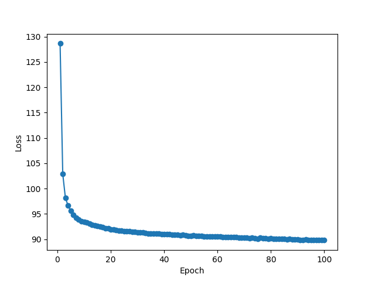
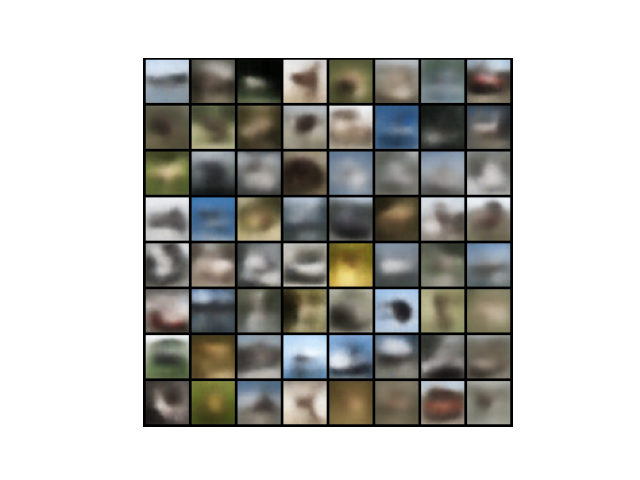

# VAE 구현
여기선 VAE의 주요 수식, 구현과정, 구현결과를 설명합니다.

## 1. Encoder
VAE의 Encoder에서는 신경망을 통해 평균 벡터와 표준 편차를 출력합니다.

$$
\mu, \sigma = NeuralNet(x; \phi)
$$

이후 KL발산 항을 최대한 줄이기 위해 ELBO값을 최대화하여 매 데이터 x마다 잠재변수 z를 얻어낸다.
이때 실제 사후 확률인 $p(z|x)$를 해석적으로 계산하는 것이 불가능하므로 다루기 쉬운 정규분포로 가정한 확률분포 $q_\phi(z|x)$로 근사한다. 이후 두 분포 사이의 차이(KL 발산)를 줄이도록 ELBO를 최대화하여 학습을 진행한다.

$$
q_\phi(z|x) = \mathcal{N}(z; \mu, \sigma^{2}I)
$$

추가적으로 Encoder의 출력값을 표준편차가 아닌 로그 분산($\log(\sigma^2)$)을 출력하고 해당 값에서 표준편차를 도출하도록 구현했다.
이렇게 하는 이유는 신경망에 의해 음수 값이 출력되는 것을 막기 위함이다.

## 2. Decoder
먼저 잠재변수 z는 평균이 0이고 공분산 행렬이 I인 고정된 정규분포에서 생성된다고 가정한다.

$$
p(z) = \mathcal{N}(z; 0, I)
$$

이렇게 얻은 z로부터 신경망을 통해 $\hat{x}$를 생성한다.

$$
\hat{x} = NeuralNet(z; \theta)
$$

여기서 VAE의 목적인 $p(x|z)$를 모델링하기 위해 $p(x|z)$를 다음과 같이 정의한다.

$$
p_\theta = \mathcal{N}(x; \hat{x}, I)
$$

따라서 x는 $\hat{x}$을 평균 벡터로 삼는 정규분포를 따른다.

## 3. ELBO Loss
VAE 학습의 목적은 로그가능도 $\log p(x)$를 최대화 하는 것이다.
하지만 직접 계산이 불가능하므로 ELBO(Evidence Lower Bound)를 최대화하여 학습한다.

$$
\log p(x) \ge \text{ELBO} = \mathbb{E}_{q_{\phi}(z|x)}[\log p_{\theta}(x|z)] - D_{KL}(q_{\phi}(z|x) || p(z))
$$

이때 ELBO의 첫 번째항을 재구성 오차항(Reconstruction error), 두 번째 항을 규제항(Regularization)으로 정의한다.

### 3.1 재구성 오차항(Reconstruction error)
위에서 $p(x|z)$에 대해 $p_\theta = \mathcal{N}(x; \hat{x}, I)$ 라고 정의했으므로 재구성 오차항은 MSE Loss와 동치가 되어 다음과 같다.

$$
Loss_{\text{Reconstruction}} \approx \frac{1}{2} \sum_{d=1}^{D}(x_d - \hat{x_d})^{2} + C
$$

### 3.2 규제항(Regularization)
ELBO를 최대화하고 싶기 때문에 KL 발산항인 규제항은 0에 가까워지도록 만든다.

$$
Loss_{\text{KL}} = -\frac{1}{2} \sum_{j=1}^{J} \left( 1 + \log(\sigma_j^2) - \mu_j^2 - \sigma_j^2 \right)
$$

### 3.3 Negative ELBO
ELBO을 손실함수로 사용하게 되면 최대화된다.
Loss는 항상 최소화시켜야하기 때문에 ELBO을 그대로 쓰지 않고 Negative ELBO를 사용한다.

$$
\begin{aligned}
Loss(x; \theta, \phi) &= - \text{ELBO} \\
&= {- \frac{1}{2} \sum_{d=1}^{D}(x_d - \hat{x_d})^{2}} + \frac{1}{2} \sum_{h=1}^{H}(1 + \log{\sigma ^{2}} - \mu^{2} - \sigma^{2}) + C
\end{aligned}
$$

구현에서는 ELBO를 최소화하기 위해 -2를 곱해주고 학습에 불필요한 상수는 없앴다.
손실 함수에 양의 상수를 곱하는 것은 학습률을 조정하는 것과 동일한 효과를 가지며, 매개변수가 최적화되는 방향(기울기) 자체에는 영향을 주지 않기 때문이다.

### 3.4 Loss Function
따라서 실제 구현에 사용한 Loss는 다음과 같다:

$$
Loss(x; \theta, \phi) \approx \sum_{d=1}^{D}(x_d - \hat{x_d})^{2} - \sum_{h=1}^{H}(1 + \log{\sigma ^{2}} - \mu^{2} - \sigma^{2})
$$

## 4. Reparameterization Trick(재매개변수화 트릭)
z를 $\mathcal{N}(\mu, \sigma^{2}I)$ 분포로 부터 샘플링 하는 부분은 미분이 불가능하므로 이를 해결하기 위해 Reparameterization Trick을 사용한다.

Reparameterization Trick은 다음과 같이 사용한다:

$$
\varepsilon \sim  \mathcal{N}(0, I) \\
z = \mu + \sigma \odot \varepsilon
$$

이를 통해 미분이 가능하면서도 z를 $\mathcal{N}(\mu, \sigma^{2}I)$에서 샘플링하는 것과 동일한 결과를 도출할 수 있다.

## 5. Model Architecture

### Encoder
- **Input**: 32x32 RGB Images (CIFAR-10)
- **Structure**: 3 Conv Layers + Flatten + Linear
- **Latent Variable**: Maps input to Mean ($\mu$) and Log-Variance ($\log\sigma^2$)

### Decoder
- **Input**: Latent Vector ($z$) sampled from $\mathcal{N}(\mu, \sigma^2I)$
- **Structure**: Linear + Unflatten + 3 Transpose Conv Layers
- **Output**: Reconstructed RGB Image

### Loss Function (ELBO)
손실함수는 ELBO를 최대화하는 함수로 정의한다.

$$
Loss(x; \theta, \phi) \approx \sum_{d=1}^{D}(x_d - \hat{x_d})^{2} - \sum_{h=1}^{H}(1 + \log{\sigma ^{2}} - \mu^{2} - \sigma^{2})
$$

- **Reconstruction Loss**: MSE
- **Regularization Loss**: KL Divergence

### Configuration (`config.py`)
- **Dataset**: CIFAR-10
- **Batch Size**: 64
- **Hidden Dim**: 128 
- **Latent Dim**: 128
- **Epochs**: 100
- **Learning Rate**: 1e-4

## 6. 실행 방법

#### 1 ) 모델 학습
```bash
python train.py
```

#### 2 ) 이미지 생성
```bash
python generate.py
```

## 7. 학습 및 이미지 생성 결과
#### 1 ) epoch에 따른 손실 그래프


#### 2 ) 생성한 이미지 샘플
